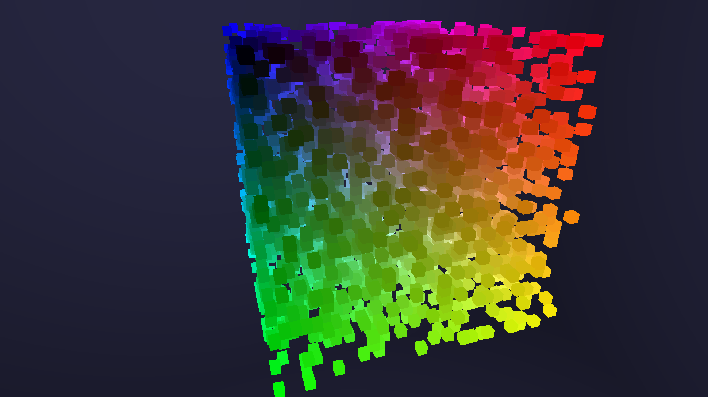

# java-voxel-raytracer

A voxel raytracer written in Java, utilizing the "A Fast Voxel Traversal Algorithm for Ray Tracing" paper
by John Amanatides and Andrew Woo. 

[The Paper](http://www.cse.yorku.ca/~amana/research/grid.pdf)

## Quick Start

The required OpenGL runtime version is 3.3.

Open the project in the IDE of your choice that supports Maven projects. (I recommend IntelliJ Idea)

## Repository structure

All code is located in src/main/.  
The Java source code is located in src/main/java.  
The shader source code is located in src/resources/shaders/.  

## Example
