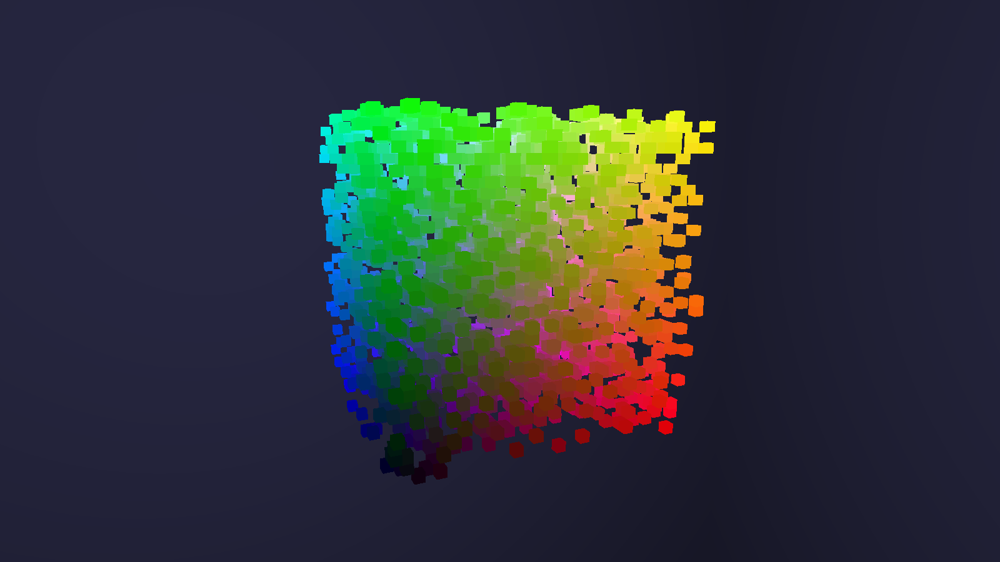
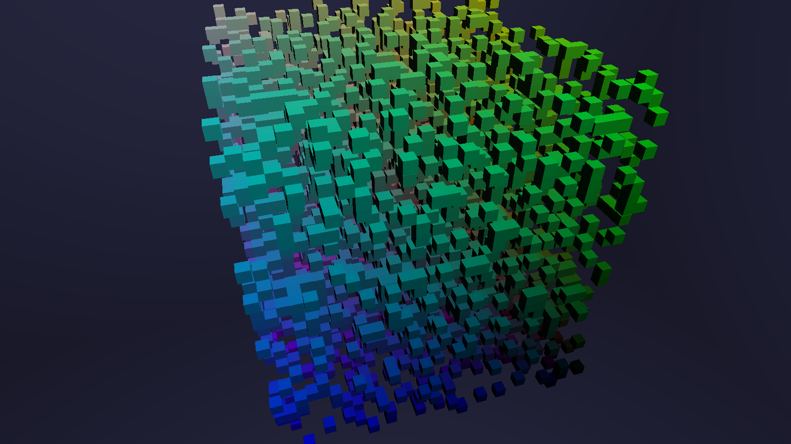
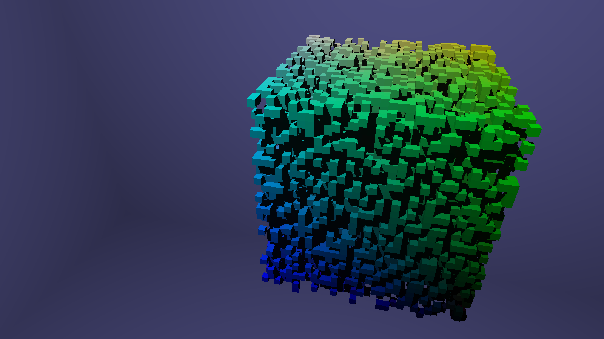
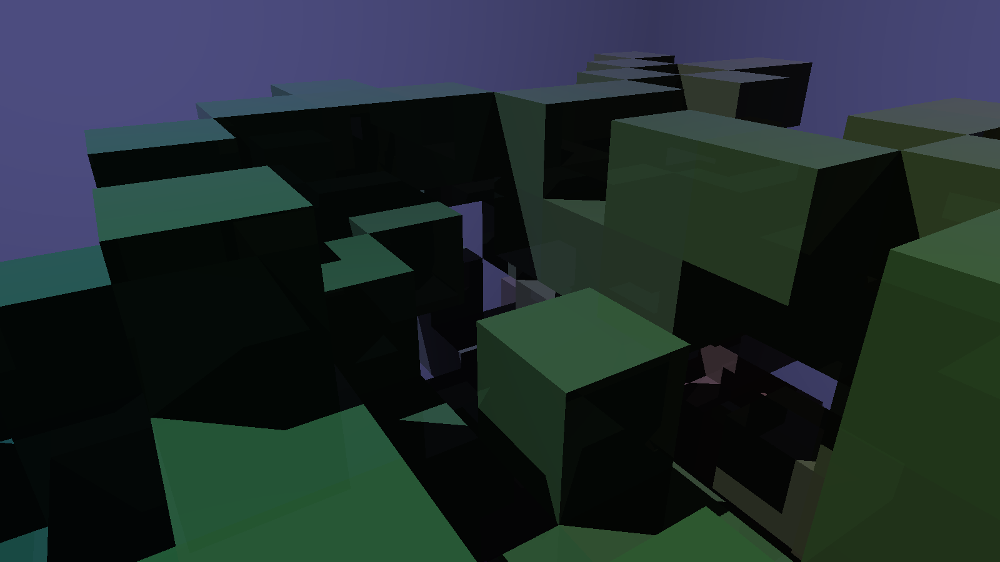
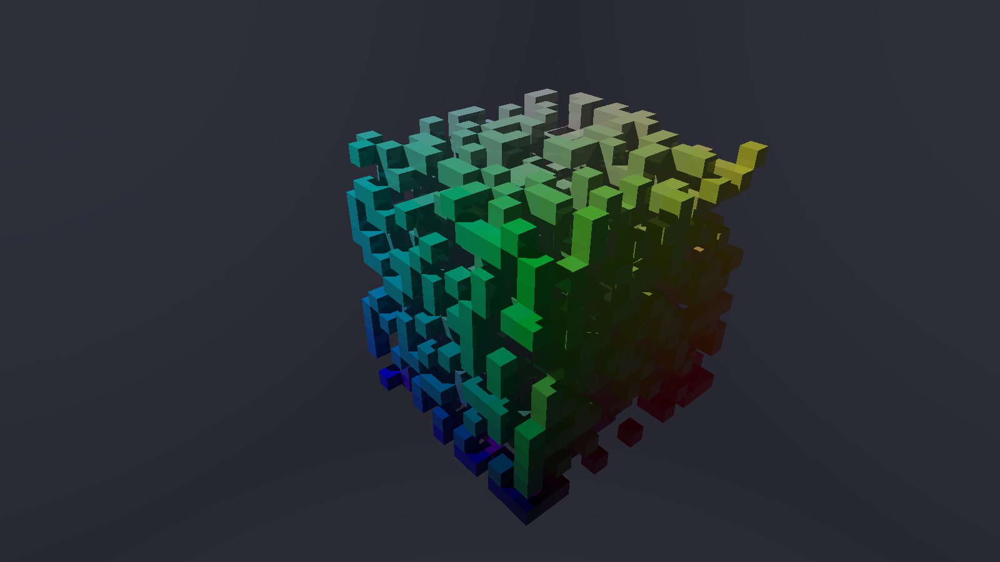
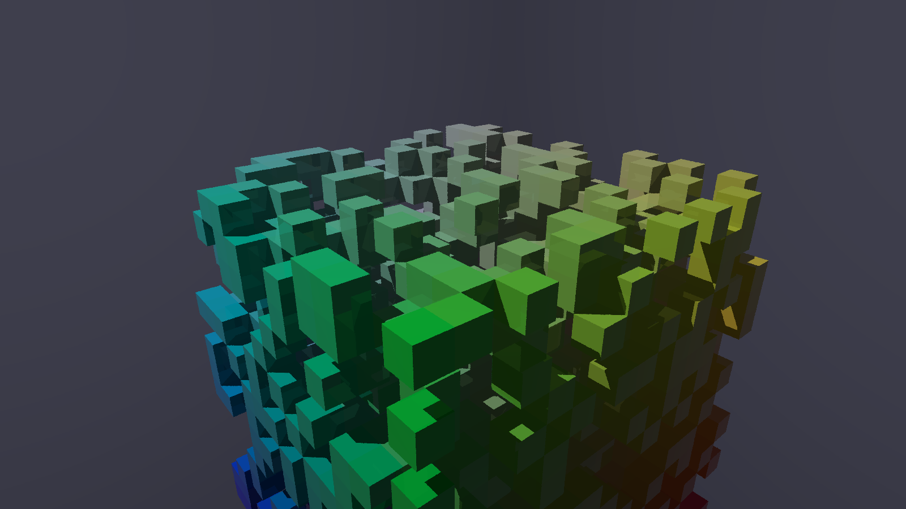
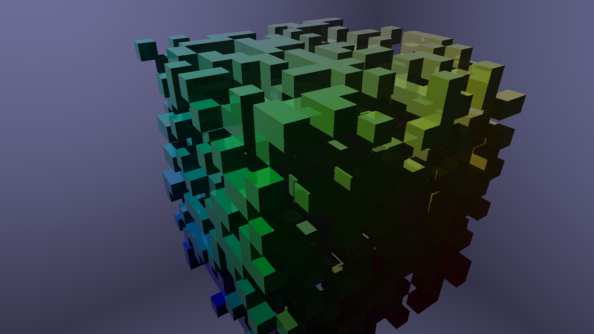

# java-voxel-raytracer

A voxel raytracer written in Java, utilizing the algorithm presented in the paper 
"A Fast Voxel Traversal Algorithm for Ray Tracing" by John Amanatides and Andrew Woo. 

[The Paper](http://www.cse.yorku.ca/~amana/research/grid.pdf)

## Quick Start

The required OpenGL runtime version is 3.3.

Open the project in the IDE of your choice that supports Maven projects. (I recommend IntelliJ Idea)

## Repository structure

The Java source code is located in src/main/java.  
The shader source code is located in src/main/resources/shaders/.  

[The heart of the raytracer, frag.glsl](src/main/resources/shaders/frag.glsl)

ou can set some parameters there yourself, mainly the light source position (only one is
present at the moment) and some reflection parameters.

## Examples

### No Shading (32x32x32)

### Basic Shading (32x32x32)

### Basic Shading + Shadows (32x32x32)

The light source is at point (-100, 200, 100).

### Basic Shading + Shadows + Reflections (16x16x16) - Close-Up

The light source is at point (-100, 200, 100).

### sRGB mapping

### Jitter Anti-Aliasing (2 samples)

### Glossy Reflections
